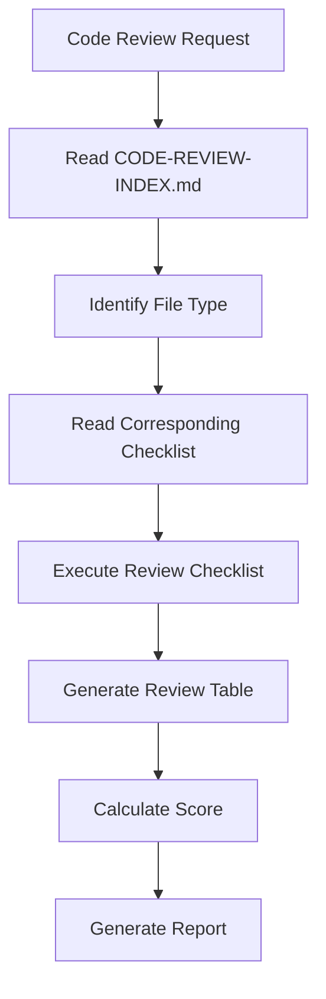

# AI Code Review Checklist

This checklist provides a comprehensive guide for reviewing AI-generated code, ensuring compliance with architecture patterns, coding standards, and DDD practices.

---

## 1. Pre-Review Process

### 1.1 Mandatory Review Workflow

> **Important**: Never start a review without following this workflow. Deviations should be flagged.



### 1.2 File Type Identification

| File Type | Review Focus | Criticality |
|-----------|--------------|-------------|
| Aggregate Root | Event Sourcing compliance, Aggregate invariants | ⭐⭐⭐ CRITICAL |
| Use Case Service | Use Case layer rules, Input/Output patterns | High |
| Controller | Adapter layer rules, HTTP mapping | Medium |
| Repository | Repository pattern, Persistence mapping | High |
| Domain Event | Event structure, Metadata inclusion | High |
| Value Object | Validation, Immutability, Equality | Medium |
| Factory | Creation logic, Validation | Medium |
| Reactor | Event handling, Idempotency | High |

---

## 2. Architecture Compliance

### 2.1 Layer Compliance

| Check Item | Result | Location | Notes |
|------------|--------|----------|-------|
| Dependencies point inward (toward domain) | ☐ | | |
| No dependency from domain to application | ☐ | | |
| No dependency from domain to infrastructure | ☐ | | |
| No dependency from application to infrastructure | ☐ | | |
| Dependency Inversion Principle applied at boundaries | ☐ | | |

### 2.2 Package Structure

| Check Item | Result | Location | Notes |
|------------|--------|----------|-------|
| Domain layer has no external dependencies | ☐ | | |
| Application layer depends only on domain | ☐ | | |
| Infrastructure layer depends on domain/application | ☐ | | |
| Ports defined in appropriate layers | ☐ | | |
| Adapters properly isolated | ☐ | | |

**Standard Package Structure:**
```
src/
├── domain/           # Pure business logic
│   ├── model/       # Entities, Value Objects
│   ├── service/     # Domain Services
│   ├── event/       # Domain Events
│   └── port/        # Secondary Ports (Repository interfaces)
├── application/     # Use Cases, Orchestration
│   ├── port/        # Primary Ports (Use Cases)
│   ├── service/     # Application Services
│   └── port/        # Secondary Ports (External services)
├── infrastructure/  # External Systems
│   ├── adapter/     # Secondary Adapters
│   └── config/      # Configuration
└── presentation/    # Entry Points
    └── adapter/     # Primary Adapters (Controllers)
```

### 2.3 Hexagonal Architecture

| Check Item | Result | Location | Notes |
|------------|--------|----------|-------|
| Ports defined as interfaces (abstractions) | ☐ | | |
| Primary ports in application layer (use cases) | ☐ | | |
| Secondary ports in domain/application layer | ☐ | | |
| Adapters implement ports correctly | ☐ | | |
| No leaky abstractions from adapters | ☐ | | |

---

## 3. Coding Standards

### 3.1 Input/Output Patterns

| Check Item | Result | Location | Notes |
|------------|--------|----------|-------|
| Input class is inner class of UseCase | ☐ | | |
| Output class is inner class of UseCase | ☐ | | |
| No separate Input.java file | ☐ | | |
| No separate Output.java file | ☐ | | |
| Input implements standard Input interface | ☐ | | |
| Output implements standard Output interface | ☐ | | |

```typescript
// ✅ GOOD - Inner class pattern
interface CreateProductUseCase {
  class CreateProductInput implements Input { ... }
  class CreateProductOutput implements Output { ... }
  execute(input: CreateProductInput): Promise<CreateProductOutput>;
}

// ❌ BAD - Separate file pattern
class CreateProductInput implements Input { ... }  // Should be inner class
```

### 3.2 Annotation Usage

| Check Item | Result | Location | Notes |
|------------|--------|----------|-------|
| No framework annotations in domain | ☐ | | |
| Services use @Bean, not @Component | ☐ | | |
| No @Service on service classes | ☐ | | |
| Repository implementations properly annotated | ☐ | | |
| Controllers properly annotated | ☐ | | |

### 3.3 Repository Pattern

| Check Item | Result | Location | Notes |
|------------|--------|----------|-------|
| Repository interface in domain layer | ☐ | | |
| Repository implementation in infrastructure | ☐ | | |
| No custom repository methods | ☐ | | |
| Uses framework GenericInMemoryRepository | ☐ | | |
| Repository methods match framework conventions | ☐ | | |

```typescript
// ✅ GOOD - Framework convention
interface ProductRepository extends Repository<Product, ProductId> {
  // Only standard methods: findById, save, delete
}

// ❌ BAD - Custom methods
interface ProductRepository {
  findById(id: ProductId): Promise<Product>;
  findByName(name: string): Promise<Product[]>;  // Custom method!
  findByCategory(category: string): Promise<Product[]>;  // Custom method!
  save(product: Product): Promise<void>;
  delete(product: Product): Promise<void>;
}
```

---

## 4. Domain-Driven Design

### 4.1 Entities

| Check Item | Result | Location | Notes |
|------------|--------|----------|-------|
| Entity has unique identity (ID) | ☐ | | |
| Identity is immutable | ☐ | | |
| Equality based on identity, not attributes | ☐ | | |
| No setId() method on entities | ☐ | | |
| Entities contain business logic | ☐ | | |
| No anemic entities (data only) | ☐ | | |
| State transitions are encapsulated | ☐ | | |
| Invariants enforced within entity | ☐ | | |

### 4.2 Value Objects

| Check Item | Result | Location | Notes |
|------------|--------|----------|-------|
| Value objects are immutable | ☐ | | |
| No setters on value objects | ☐ | | |
| All properties are readonly | ☐ | | |
| Operations return new instances | ☐ | | |
| Validation in constructor | ☐ | | |
| Throws specific domain errors | ☐ | | |
| Validation uses Objects.requireNonNull, not Contract | ☐ | | |
| Equals based on all attributes | ☐ | | |
| No primitive obsession | ☐ | | |

```typescript
// ✅ GOOD - Proper value object
class Money implements ValueObject {
  private readonly amount: number;
  private readonly currency: Currency;

  constructor(amount: number, currency: Currency) {
    if (amount < 0) throw new MoneyCannotBeNegativeError();
    this.amount = Math.round(amount * 100) / 100;
    this.currency = currency;
  }

  add(other: Money): Money {
    return new Money(this.amount + other.amount, this.currency);
  }

  equals(other: ValueObject): boolean {
    return other instanceof Money && 
           this.amount === other.amount && 
           this.currency.equals(other.currency);
  }
}

// ❌ BAD - Uses Contract.requireNotNull
class Email {
  constructor(value: string) {
    Contract.requireNotNull(value, 'Email must not be null');  // Wrong!
    // ...
  }
}
```

### 4.3 Aggregates

| Check Item | Result | Location | Notes |
|------------|--------|----------|-------|
| Single aggregate root per aggregate | ☐ | | |
| Root controls access to internals | ☐ | | |
| Root enforces invariants | ☐ | | |
| Root manages internal entities | ☐ | | |
| Root records domain events | ☐ | | |
| Only root is accessed from outside | ☐ | | |
| No direct references to internal entities | ☐ | | |
| External references use ID only | ☐ | | |
| Aggregate is small and focused | ☐ | | |
| No god aggregates | ☐ | | |

### 4.4 Domain Events

| Check Item | Result | Location | Notes |
|------------|--------|----------|-------|
| Named in past tense | ☐ | | |
| Immutable (frozen) | ☐ | | |
| Contains all necessary data | ☐ | | |
| Self-contained (no lazy loading) | ☐ | | |
| Includes metadata | ☐ | | |
| Serializable | ☐ | | |
| Events raised by aggregates | ☐ | | |
| Events published through ports | ☐ | | |

```typescript
// ✅ GOOD - Domain event with metadata
class OrderSubmitted implements DomainEvent {
  readonly orderId: OrderId;
  readonly customerId: CustomerId;
  readonly totalAmount: Money;
  readonly submittedAt: DateTime;
  readonly eventId: EventId;
  readonly metadata: EventMetadata;

  constructor(orderId: OrderId, customerId: CustomerId, totalAmount: Money) {
    this.orderId = orderId;
    this.customerId = customerId;
    this.totalAmount = totalAmount;
    this.submittedAt = DateTime.now();
    this.eventId = EventId.generate();
    this.metadata = EventMetadata.withContext();
  }
}
```

---

## 5. Business Logic

### 5.1 Contract Validation

| Check Item | Result | Location | Notes |
|------------|--------|----------|-------|
| Validation in constructors | ☐ | | |
| Throws specific domain errors | ☐ | | |
| Validation logic in value object/entity | ☐ | | |
| No invalid instances can exist | ☐ | | |
| Null checks use proper validation | ☐ | | |

### 5.2 Error Handling

| Check Item | Result | Location | Notes |
|------------|--------|----------|-------|
| Specific exception types used | ☐ | | |
| No empty catch blocks | ☐ | | |
| Errors logged with context | ☐ | | |
| No swallowing of errors | ☐ | | |
| Custom error types for domain | ☐ | | |

### 5.3 Invariants

| Check Item | Result | Location | Notes |
|------------|--------|----------|-------|
| All invariants enforced in aggregate root | ☐ | | |
| Invariants checked after modifications | ☐ | | |
| Consistent state after each operation | ☐ | | |
| No partially valid states | ☐ | | |
| Business rules in aggregate, not service | ☐ | | |

---

## 6. Testability

### 6.1 Dependencies

| Check Item | Result | Location | Notes |
|------------|--------|----------|-------|
| Dependencies injected via constructor | ☐ | | |
| No static references to framework | ☐ | | |
| Can be unit tested in isolation | ☐ | | |
| No hardcoded dependencies | ☐ | | |

### 6.2 Test Structure

| Check Item | Result | Location | Notes |
|------------|--------|----------|-------|
| Tests co-located with source | ☐ | | |
| Test file naming consistent | ☐ | | |
| Uses project test conventions | ☐ | | |
| No commented-out tests | ☐ | | |
| Proper setup/teardown | ☐ | | |

---

## 7. Common AI Mistakes

### 7.1 Critical Issues

| Check Item | Result | Location | Notes |
|------------|--------|----------|-------|
| No separate Input.java file | ☐ | | |
| No custom repository interfaces | ☐ | | |
| Repository interface in domain | ☐ | | |
| Anemic domain model | ☐ | | |
| Missing aggregate invariants | ☐ | | |

### 7.2 High Priority Issues

| Check Item | Result | Location | Notes |
|------------|--------|----------|-------|
| No instanceof chains | ☐ | | |
| Value objects use Objects.requireNonNull | ☐ | | |
| No primitive obsession | ☐ | | |
| Mutable value objects | ☐ | | |
| Domain events without metadata | ☐ | | |
| No soft delete pattern | ☐ | | |

### 7.3 Medium Priority Issues

| Check Item | Result | Location | Notes |
|------------|--------|----------|-------|
| Service with @Service annotation | ☐ | | |
| Technical naming in domain | ☐ | | |
| No domain events raised | ☐ | | |
| Service has state | ☐ | | |
| Complex nested conditionals | ☐ | | |

---

## 8. Scoring Guide

| Category | Weight | Score (1-5) |
|----------|--------|-------------|
| Architecture Compliance | 25% | |
| Coding Standards | 20% | |
| DDD Patterns | 25% | |
| Business Logic | 15% | |
| Testability | 10% | |
| AI-Specific Checks | 5% | |

**Total Score:** _____ / 5

### Score Interpretation

| Score | Rating | Action |
|-------|--------|--------|
| 5 | ⭐⭐⭐⭐⭐ Excellent | Ready to merge |
| 4 | ⭐⭐⭐⭐ Good | Minor fixes |
| 3 | ⭐⭐⭐ Acceptable | Should fix issues |
| 2 | ⭐⭐ Needs Work | Must fix issues |
| 1 | ⭐ Critical | Blocked, major rework needed |

---

## 9. Review Output Format

### 9.1 Detailed Review Table

```markdown
## Code Review Report

| Check Item | Result | Location | Issue Description |
|------------|--------|----------|-------------------|
| Package Location | ✅ | - | Correct |
| Input as Inner Class | ❌ | Line 45 | Input should be UseCase inner class |
| Repository Pattern | ✅ | - | Correct |
| Value Object Validation | ⚠️ | Line 78 | Uses Contract.requireNotNull |
| Domain Events | ✅ | - | Correct |
```

### 9.2 Summary Format

```markdown
### Summary
- **Critical Issues**: 0
- **Must Fix Issues**: 1
- **Should Fix Issues**: 2
- **Score**: 4/5 ⭐⭐⭐⭐
```

### 9.3 Issue Severity

| Severity | Description | Action Required |
|----------|-------------|-----------------|
| Critical | Architecture violation, will cause runtime errors | Must fix before merge |
| High | Pattern violation, may cause issues | Must fix |
| Medium | Convention violation, should fix | Should fix |
| Low | Style preference, optional | Can fix |

---

## 10. References

1. Clean Architecture - Robert C. Martin
2. Hexagonal Architecture - Alistair Cockburn
3. Domain-Driven Design - Eric Evans
4. ref/ai-coding-exercise-analysis.md - Code Review Framework
5. ref/ai-coding-exercise/CLAUDE.md - Code Review Process
6. doc/clean-code.md - AI Code Review Checklist
7. dev-knowledge/07-review-checklists/code-review.md
8. dev-knowledge/07-review-checklists/architecture-review.md
9. dev-knowledge/07-review-checklists/ddd-review.md
