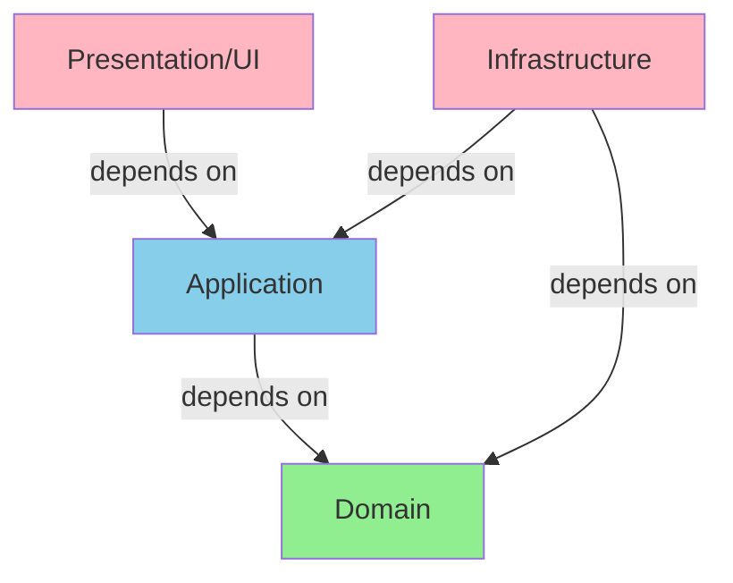

# Architecture Review Checklist

This checklist provides a comprehensive guide for reviewing code architecture, ensuring adherence to clean architecture principles, DDD patterns, and hexagonal architecture boundaries.

---

## 1. Layer Compliance

### 1.1 Dependency Direction

| Check Item | Result | Location | Notes |
|------------|--------|----------|-------|
| Dependencies point inward (toward domain) | ☐ | | |
| No dependency from domain to application | ☐ | | |
| No dependency from domain to infrastructure | ☐ | | |
| No dependency from application to infrastructure | ☐ | | |
| Dependency Inversion Principle applied at boundaries | ☐ | | |

**Verification:**


### 1.2 Package Structure

| Check Item | Result | Location | Notes |
|------------|--------|----------|-------|
| Domain layer has no external dependencies | ☐ | | |
| Application layer depends only on domain | ☐ | | |
| Infrastructure layer depends on domain/application | ☐ | | |
| Ports defined in appropriate layers | ☐ | | |
| Adapters properly isolated | ☐ | | |

**Standard Package Structure:**
```
src/
├── domain/           # Pure business logic
│   ├── model/       # Entities, Value Objects
│   ├── service/     # Domain Services
│   ├── event/       # Domain Events
│   └── port/        # Secondary Ports (Repository interfaces)
├── application/     # Use Cases, Orchestration
│   ├── port/        # Primary Ports (Use Cases)
│   ├── service/     # Application Services
│   └── port/        # Secondary Ports (External services)
├── infrastructure/  # External Systems
│   ├── adapter/     # Secondary Adapters
│   └── config/      # Configuration
└── presentation/    # Entry Points
    └── adapter/     # Primary Adapters (Controllers)
```

---

## 2. Hexagonal Architecture Compliance

### 2.1 Ports and Adapters

| Check Item | Result | Location | Notes |
|------------|--------|----------|-------|
| Ports defined as interfaces (abstractions) | ☐ | | |
| Primary ports in application layer (use cases) | ☐ | | |
| Secondary ports in domain/application layer | ☐ | | |
| Adapters implement ports correctly | ☐ | | |
| No leaky abstractions from adapters | ☐ | | |

### 2.2 Primary Adapters (Entry Points)

| Check Item | Result | Location | Notes |
|------------|--------|----------|-------|
| Controllers are thin (no business logic) | ☐ | | |
| Controllers translate external to internal | ☐ | | |
| Controllers delegate to use cases | ☐ | | |
| No SQL, HTTP, or framework code in controllers | ☐ | | |
| Proper error handling and HTTP mapping | ☐ | | |

**Example - Thin Controller:**
```typescript
// ✅ GOOD - Thin controller
@Controller('/users')
class UserController {
  constructor(private createUserUseCase: CreateUserPort) {}

  @Post()
  async createUser(@Body() request: CreateUserRequest): Promise<Response> {
    const command = new CreateUserCommand(request.email, request.name);
    const response = await this.createUserUseCase.execute(command);
    return new Response(201, { userId: response.userId });
  }
}

// ❌ BAD - Fat controller with business logic
@Controller('/users')
class UserController {
  @Post()
  async createUser(@Body() request: CreateUserRequest): Promise<Response> {
    const email = new Email(request.email); // Business logic!
    const user = User.create(email, request.name); // Domain logic!
    await this.repository.save(user); // Persistence logic!
    // ...
  }
}
```

### 2.3 Secondary Adapters (External Systems)

| Check Item | Result | Location | Notes |
|------------|--------|----------|-------|
| Repository implementations in infrastructure | ☐ | | |
| External service adapters isolated | ☐ | | |
| ORM mapping contained in adapters | ☐ | | |
| No domain objects leaked to adapters | ☐ | | |
| Error translation at adapter boundaries | ☐ | | |

---

## 3. Clean Architecture Rules

### 3.1 Independence from Frameworks

| Check Item | Result | Location | Notes |
|------------|--------|----------|-------|
| Domain code does not import frameworks | ☐ | | |
| No framework annotations in domain | ☐ | | |
| Business rules testable without frameworks | ☐ | | |
| UI, DB, and external concerns are plugins | ☐ | | |

### 3.2 Testability

| Check Item | Result | Location | Notes |
|------------|--------|----------|-------|
| Domain logic testable in isolation | ☐ | | |
| Use cases testable with mocks | ☐ | | |
| No framework dependencies in unit tests | ☐ | | |
| Integration tests use test doubles | ☐ | | |

### 3.3 UI Independence

| Check Item | Result | Location | Notes |
|------------|--------|----------|-------|
| Business logic not dependent on UI | ☐ | | |
| Same use case works for CLI, REST, GraphQL | ☐ | | |
| No UI framework imports in inner layers | ☐ | | |

### 3.4 Database Independence

| Check Item | Result | Location | Notes |
|------------|--------|----------|-------|
| Domain objects not tied to ORM | ☐ | | |
| Repository interface in domain layer | ☐ | | |
| Multiple DB implementations possible | ☐ | | |
| No SQL in domain or application | ☐ | | |

---

## 4. Architecture Decision Records

### 4.1 ADR Compliance

| Check Item | Result | Location | Notes |
|------------|--------|----------|-------|
| New decisions documented in ADR format | ☐ | | |
| ADR includes context and decision | ☐ | | |
| ADR includes consequences (positive/negative) | ☐ | | |
| ADR status is correctly set | ☐ | | |
| Architecture deviations have ADRs | ☐ | | |

**ADR Format:**
```markdown
# ADR-{NNN}: {Title}

## Status
[Proposed | Accepted | Deprecated | Superseded]

## Context
What is the issue that we're seeing that is motivating this decision?

## Decision
What is the change that we're proposing and/or doing?

## Consequences
What becomes easier or more difficult because of this change?
```

---

## 5. Bounded Context Boundaries

| Check Item | Result | Location | Notes |
|------------|--------|----------|-------|
| Bounded contexts clearly defined | ☐ | | |
| Context map documented | ☐ | | |
| Shared kernels identified | ☐ | | |
| Anticorruption layers where needed | ☐ | | |
| No bounded context bleeding | ☐ | | |

---

## 6. Security Architecture

| Check Item | Result | Location | Notes |
|------------|--------|----------|-------|
| Authentication at entry points | ☐ | | |
| Authorization at use case level | ☐ | | |
| Sensitive data encrypted | ☐ | | |
| No hardcoded secrets | ☐ | | |
| Input validation at boundaries | ☐ | | |

---

## 7. Performance Considerations

| Check Item | Result | Location | Notes |
|------------|--------|----------|-------|
| N+1 query patterns avoided | ☐ | | |
| Lazy loading where appropriate | ☐ | | |
| Caching strategy defined | ☐ | | |
| Async processing for long operations | ☐ | | |
| No blocking calls in request paths | ☐ | | |

---

## 8. Scoring Guide

| Category | Weight | Score (1-5) |
|----------|--------|-------------|
| Layer Compliance | 25% | |
| Hexagonal Architecture | 25% | |
| Clean Architecture Rules | 20% | |
| ADR Compliance | 10% | |
| Bounded Contexts | 10% | |
| Security | 5% | |
| Performance | 5% | |

**Total Score:** _____ / 5

---

## 9. Common Issues to Flag

| Issue | Severity | Fix |
|-------|----------|-----|
| Domain depending on infrastructure | Critical | Refactor to use ports |
| Business logic in controllers | High | Extract to use cases |
| ORM annotations in domain | High | Move to adapters |
| Missing ADR for new pattern | Medium | Document decision |
| Hardcoded configuration | Medium | Externalize config |
| No input validation | High | Add validation layer |

---

## 10. AI-Specific Architecture Checks

### 10.1 AI Pattern Compliance

| Check Item | Result | Location | Notes |
|------------|--------|----------|-------|
| No separate Input/Output files | ☐ | | |
| Input/Output as inner classes | ☐ | | |
| Framework adapters isolated | ☐ | | |
| No business logic in controllers | ☐ | | |
| Repository interfaces in domain | ☐ | | |
| Repository implementations in infra | ☐ | | |

### 10.2 Event Sourcing Architecture

| Check Item | Result | Location | Notes |
|------------|--------|----------|-------|
| Domain events properly defined | ☐ | | |
| Event metadata included | ☐ | | |
| Aggregate state from events | ☐ | | |
| Event handlers are idempotent | ☐ | | |
| No event sourcing violations in aggregates | ☐ | | |

### 10.3 Soft Delete Pattern

| Check Item | Result | Location | Notes |
|------------|--------|----------|-------|
| Soft delete implemented where needed | ☐ | | |
| Deleted flag in aggregate state | ☐ | | |
| Queries filter deleted records | ☐ | | |
| Event sourcing maintains delete history | ☐ | | |

---

## 11. Review Process

1. **Pre-review**: Ensure all files are committed
2. **Layer check**: Verify dependency direction with dependency graph
3. **Pattern check**: Confirm adherence to defined patterns
4. **Test check**: Verify test coverage and structure
5. **Documentation check**: Ensure ADRs are updated
6. **Score**: Calculate architecture score
7. **Report**: Generate review report with findings

---

## References

1. Clean Architecture - Robert C. Martin
2. Hexagonal Architecture - Alistair Cockburn
3. Domain-Driven Design - Eric Evans
4. ref/ai-coding-exercise-analysis.md - Review framework
5. ref/ai-coding-exercise/CLAUDE.md - Code Review Process
6. doc/clean-code.md - AI Code Review Checklist
