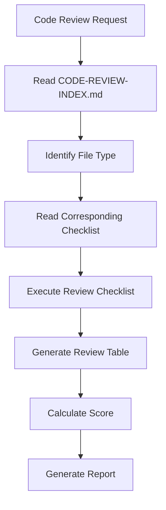

# Code Review Checklist

This checklist provides a comprehensive guide for reviewing code for quality, maintainability, security, and adherence to project standards.

---

## 1. Code Quality Fundamentals

### 1.1 Readability

| Check Item | Result | Location | Notes |
|------------|--------|----------|-------|
| Meaningful variable and function names | ☐ | | |
| Functions do one thing | ☐ | | |
| Code blocks are small and focused | ☐ | | |
| Complex logic has comments explaining why | ☐ | | |
| No magic numbers or strings | ☐ | | |

**Examples:**
```typescript
// ✅ GOOD - Descriptive names
const calculateOrderTotalWithTax = (order: Order): Money => {
  const subtotal = order.items.reduce((sum, item) => sum.add(item.price), Money.zero());
  const tax = subtotal.multiply(order.taxRate);
  return subtotal.add(tax);
};

// ❌ BAD - Unclear names
const calc = (o: Order): Money => {
  const s = o.items.reduce((a, i) => a.add(i.p), Money.zero());
  const t = s.mul(o.tr);
  return s.add(t);
};
```

### 1.2 Complexity

| Check Item | Result | Location | Notes |
|------------|--------|----------|-------|
| Cyclomatic complexity < 10 per function | ☐ | | |
| No deeply nested conditionals (> 3 levels) | ☐ | | |
| Early returns used to reduce nesting | ☐ | | |
| Complex conditions extracted to variables | ☐ | | |
| No redundant code (DRY principle) | ☐ | | |

### 1.3 Formatting and Style

| Check Item | Result | Location | Notes |
|------------|--------|----------|-------|
| Consistent indentation | ☐ | | |
| Proper spacing around operators | ☐ | | |
| Aligned variable declarations | ☐ | | |
| Consistent brace style | ☐ | | |
| Line length within limits (100-120 chars) | ☐ | | |

---

## 2. TypeScript/Type Safety

### 2.1 Type Annotations

| Check Item | Result | Location | Notes |
|------------|--------|----------|-------|
| All functions have return types | ☐ | | |
| All parameters have types | ☐ | | |
| No implicit `any` types | ☐ | | |
| No `any` used without explicit annotation | ☐ | | |
| Proper use of generics | ☐ | | |

```typescript
// ✅ GOOD
async function getUserById(id: UserId): Promise<User | null> {
  return userRepository.findById(id);
}

// ❌ BAD - Missing types
async function getUser(id) {
  return userRepository.findById(id);
}
```

### 2.2 Strict Mode Compliance

| Check Item | Result | Location | Notes |
|------------|--------|----------|-------|
| `strict: true` enabled in tsconfig | ☐ | | |
| `noImplicitAny: true` | ☐ | | |
| `strictNullChecks: true` | ☐ | | |
| `noUncheckedIndexedAccess: true` | ☐ | | |

### 2.3 Immutability

| Check Item | Result | Location | Notes |
|------------|--------|----------|-------|
| Use `readonly` for arrays | ☐ | | |
| Use `readonly` for properties | ☐ | | |
| Avoid mutating parameters | ☐ | | |
| Use spread operator for copies | ☐ | | |

---

## 3. Error Handling

### 3.1 Exception Handling

| Check Item | Result | Location | Notes |
|------------|--------|----------|-------|
| Specific exception types used | ☐ | | |
| No empty catch blocks | ☐ | | |
| Errors logged with context | ☐ | | |
| No swallowing of errors | ☐ | | |
| Custom error types for domain | ☐ | | |

```typescript
// ✅ GOOD - Specific error types
class UserNotFoundError extends Error {
  constructor(public readonly userId: UserId) {
    super(`User not found: ${userId}`);
    this.name = 'UserNotFoundError';
  }
}

// ❌ BAD - Generic errors
try {
  // ...
} catch (e) {
  console.log('Error');
}
```

### 3.2 Result Pattern

| Check Item | Result | Location | Notes |
|------------|--------|----------|-------|
| Use Result/Output types where appropriate | ☐ | | |
| No returning null for operations | ☐ | | |
| Proper null handling with Optional | ☐ | | |
| No unchecked null assertions | ☐ | | |

---

## 4. Security

### 4.1 Input Validation

| Check Item | Result | Location | Notes |
|------------|--------|----------|-------|
| All external input validated | ☐ | | |
| Sanitize user inputs | ☐ | | |
| SQL injection prevention | ☐ | | |
| XSS prevention | ☐ | | |
| Command injection prevention | ☐ | | |

### 4.2 Secrets Management

| Check Item | Result | Location | Notes |
|------------|--------|----------|-------|
| No hardcoded API keys | ☐ | | |
| No hardcoded passwords | ☐ | | |
| No hardcoded secrets in code | ☐ | | |
| Environment variables for secrets | ☐ | | |
| No secrets in logs | ☐ | | |

```typescript
// ✅ GOOD
const apiKey = process.env.API_KEY;
if (!apiKey) throw new ConfigurationError('API_KEY not set');

// ❌ BAD - Hardcoded secret
const apiKey = 'sk-1234567890abcdef';
```

### 4.3 Authentication & Authorization

| Check Item | Result | Location | Notes |
|------------|--------|----------|-------|
| Authentication required for protected endpoints | ☐ | | |
| Authorization checks at appropriate level | ☐ | | |
| No bypass of auth checks | ☐ | | |
| Proper session management | ☐ | | |
| Secure token handling | ☐ | | |

---

## 5. Testing

### 5.1 Test Coverage

| Check Item | Result | Location | Notes |
|------------|--------|----------|-------|
| Unit tests for business logic | ☐ | | |
| Edge cases covered | ☐ | | |
| Error conditions tested | ☐ | | |
| No test for trivial code | ☐ | | |
| Tests are independent | ☐ | | |

### 5.2 Test Quality

| Check Item | Result | Location | Notes |
|------------|--------|----------|-------|
| Descriptive test names | ☐ | | |
| Arrange-Act-Assert pattern | ☐ | | |
| No test logic duplication | ☐ | | |
| Tests run fast (< 100ms each) | ☐ | | |
| Mocks for external dependencies | ☐ | | |

### 5.3 Test Structure

| Check Item | Result | Location | Notes |
|------------|--------|----------|-------|
| Tests co-located with source | ☐ | | |
| Test file naming consistent | ☐ | | |
| No commented-out tests | ☐ | | |
| Proper setup/teardown | ☐ | | |
| Tests use project conventions | ☐ | | |

---

## 6. Performance

### 6.1 Resource Management

| Check Item | Result | Location | Notes |
|------------|--------|----------|-------|
| No memory leaks | ☐ | | |
| Resources properly closed | ☐ | | |
| Database connections pooled | ☐ | | |
| No unnecessary object creation | ☐ | | |
| Stream handling correct | ☐ | | |

### 6.2 Query Optimization

| Check Item | Result | Location | Notes |
|------------|--------|----------|-------|
| No N+1 query problems | ☐ | | |
| Proper indexing in queries | ☐ | | |
| Pagination for large datasets | ☐ | | |
| Batch operations over loops | ☐ | | |
| Caching where appropriate | ☐ | | |

### 6.3 Async Performance

| Check Item | Result | Location | Notes |
|------------|--------|----------|-------|
| No blocking async calls | ☐ | | |
| Proper use of Promise.all | ☐ | | |
| Timeout handling for external calls | ☐ | | |
| Rate limiting where needed | ☐ | | |
| Backoff for retries | ☐ | | |

---

## 7. Maintainability

### 7.1 Code Organization

| Check Item | Result | Location | Notes |
|------------|--------|----------|-------|
| Files organized by feature | ☐ | | |
| Barrel exports used appropriately | ☐ | | |
| No circular imports | ☐ | | |
| Constants grouped logically | ☐ | | |
| Utility functions extracted | ☐ | | |

### 7.2 Documentation

| Check Item | Result | Location | Notes |
|------------|--------|----------|-------|
| Public APIs documented | ☐ | | |
| Complex logic explained | ☐ | | |
| TODO comments with context | ☐ | | |
| No outdated comments | ☐ | | |
| README updated for new features | ☐ | | |

### 7.3 Refactoring Ready

| Check Item | Result | Location | Notes |
|------------|--------|----------|-------|
| Small, focused functions | ☐ | | |
| Low coupling between modules | ☐ | | |
| High cohesion within modules | ☐ | | |
| No god classes/objects | ☐ | | |
| Dependency injection used | ☐ | | |

---

## 8. Git/Version Control

| Check Item | Result | Location | Notes |
|------------|--------|----------|-------|
| Commit messages follow convention | ☐ | | |
| Small, focused commits | ☐ | | |
| No binary files in commits | ☐ | | |
| No sensitive data in commits | ☐ | | |
| Branches follow naming convention | ☐ | | |

---

## 9. AI-Generated Code Specific Checks

### 9.1 Common AI Mistakes

| Check Item | Result | Location | Notes |
|------------|--------|----------|-------|
| No "Input.java" separate file (should be inner class) | ☐ | | |
| No custom repository interfaces (use framework) | ☐ | | |
| No instanceof chains (use pattern matching) | ☐ | | |
| Value objects use Objects.requireNonNull, not Contract | ☐ | | |
| No primitive obsession (use value objects) | ☐ | | |

### 9.2 Pattern Compliance

| Check Item | Result | Location | Notes |
|------------|--------|----------|-------|
| Follows project coding standards | ☐ | | |
| Uses established patterns | ☐ | | |
| Consistent with existing code | ☐ | | |
| No over-engineering | ☐ | | |
| No under-engineering | ☐ | | |

---

## 10. Scoring Guide

| Category | Weight | Score (1-5) |
|----------|--------|-------------|
| Code Quality | 20% | |
| Type Safety | 15% | |
| Error Handling | 10% | |
| Security | 15% | |
| Testing | 15% | |
| Performance | 10% | |
| Maintainability | 10% | |
| Git/Version Control | 5% | |

**Total Score:** _____ / 5

---

## 11. Review Output Format

```markdown
## Code Review Report

| Check Item | Result | Location | Issue Description |
|------------|--------|----------|-------------------|
| Function naming | ✅ | - | Correct |
| Input validation | ❌ | Line 45 | Missing email validation |
| Error handling | ✅ | - | Correct |
| Test coverage | ⚠️ | Line 78 | Edge case not tested |

### Summary
- **Critical Issues**: 0
- **Must Fix Issues**: 1
- **Should Fix Issues**: 2
- **Score**: 4/5 ⭐⭐⭐⭐
```

---

## 12. Common Issues Reference

| Issue | Severity | Correct Approach |
|-------|----------|-----------------|
| Missing input validation | High | Validate at boundary |
| Hardcoded secrets | Critical | Use environment variables |
| Generic exception handling | Medium | Use specific exception types |
| No test for business logic | High | Add unit tests |
| Complex nested conditionals | Medium | Extract to well-named functions |
| No error handling | High | Add try-catch with specific errors |
| Mutating parameters | Medium | Use immutable operations |
| Missing return types | Low | Add explicit return types |

---

## 13. AI-Specific Review Process

### 13.1 Mandatory Review Workflow



> **Important**: Never start a review without following this workflow. Deviations should be flagged.

### 13.2 File Type Identification

| File Type | Review Focus | Criticality |
|-----------|--------------|-------------|
| Aggregate Root | Event Sourcing compliance, Aggregate invariants | ⭐⭐⭐ CRITICAL |
| Use Case Service | Use Case layer rules, Input/Output patterns | High |
| Controller | Adapter layer rules, HTTP mapping | Medium |
| Repository | Repository pattern, Persistence mapping | High |
| Domain Event | Event structure, Metadata inclusion | High |
| Value Object | Validation, Immutability, Equality | Medium |

### 13.3 Review Priority Levels

| Priority | Check Focus | Response Required |
|----------|-------------|-------------------|
| **Level 1** | Architecture & Structure | Must Fix |
| **Level 2** | Coding Standards | Must Fix |
| **Level 3** | Business Logic | Should Fix |

**Level 1 - Architecture & Structure (Highest Priority)**
| Check Item | Result | Location | Notes |
|------------|--------|----------|-------|
| Package location follows layer structure | ☐ | | |
| Clean Architecture boundaries respected | ☐ | | |
| Dependency direction is correct (inward) | ☐ | | |
| Package declaration matches actual path | ☐ | | |

**Level 2 - Coding Standards**
| Check Item | Result | Location | Notes |
|------------|--------|----------|-------|
| Input class is inner class of UseCase | ☐ | | |
| Output class is inner class of UseCase | ☐ | | |
| Value Objects use proper validation | ☐ | | |
| Repository interface in domain, impl in infra | ☐ | | |
| No framework annotations in domain | ☐ | | |

**Level 3 - Business Logic**
| Check Item | Result | Location | Notes |
|------------|--------|----------|-------|
| Contract validation in constructors | ☐ | | |
| Domain events properly applied | ☐ | | |
| Aggregate invariants enforced | ☐ | | |
| Error handling is appropriate | ☐ | | |

---

## 14. Common AI-Generated Code Anti-Patterns

| Anti-Pattern | Severity | Correct Approach |
|--------------|----------|-----------------|
| Separate Input.java file | Critical | Use inner class |
| Custom repository methods | High | Use framework methods |
| Mutable value objects | High | Make immutable |
| Service with @Service annotation | Medium | Use @Bean registration |
| Domain events without metadata | High | Include metadata |
| instanceof chains | Medium | Use pattern matching |
| Primitive obsession | Medium | Use value objects |
| Soft delete missing | Medium | Implement soft delete pattern |

---

## 15. Review Output Format

```markdown
## Code Review Report

| Check Item | Result | Location | Issue Description |
|------------|--------|----------|-------------------|
| Package Location | ✅ | - | Correct |
| Input as Inner Class | ❌ | Line 45 | Input should be UseCase inner class |
| Repository Pattern | ✅ | - | Correct |

### Summary
- **Critical Issues**: 0
- **Must Fix Issues**: 1
- **Should Fix Issues**: 2
- **Score**: 4/5 ⭐⭐⭐⭐
```

---

## References

1. Clean Code - Robert C. Martin
2. TypeScript Deep Dive
3. ref/ai-coding-exercise-analysis.md - Code Review Framework
4. 04-coding-style/typescript-conventions.md
5. 04-coding-style/naming-conventions.md
6. ref/ai-coding-exercise/CLAUDE.md - Code Review Process
7. doc/clean-code.md - AI Code Review Checklist
