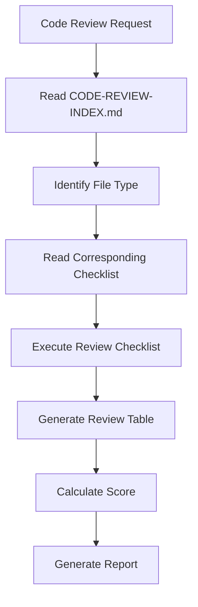

# AI Agent Development Guidelines

This document provides comprehensive guidelines for developing and working with AI coding agents effectively.

---

## 1. Context Engineering for AI Agents

### 1.1 The Context Challenge

AI agents face fundamental limitations in processing project information:

```
┌─────────────────────────────────────────────────────────────────────────┐
│                 CONTEXT GAP ANALYSIS                                      │
├─────────────────────────────────────────────────────────────────────────┤
│                                                                         │
│  Enterprise Project Information:                                         │
│  ━━━━━━━━━━━━━━━━━━━━━━━━━━━━━━━━━━━━━                                  │
│  Codebase (monorepo):     10M - 100M+ tokens                            │
│  Documentation:           1M - 10M tokens                               │
│  Coding standards:        100K - 500K tokens                            │
│  Architecture decisions:  100K - 300K tokens                            │
│  Team conventions:        50K - 200K tokens                             │
│  Regulatory requirements: 100K - 1M tokens                              │
│  ━━━━━━━━━━━━━━━━━━━━━━━━━━━━━━━━━━━━━                                  │
│  Total Relevant:           12M - 112M tokens                            │
│                                                                         │
│  Available Context:                                                         │
│  ━━━━━━━━━━━━━━━━━━━━━━━━━━━━━━━━━━━━━                                  │
│  GPT-4o:                   128K tokens                                  │
│  Claude 3.5 Sonnet:        200K tokens                                  │
│  Claude 4:                 1M tokens                                    │
│  Gemini 1.5 Pro:           1M-2M tokens                                 │
│  ━━━━━━━━━━━━━━━━━━━━━━━━━━━━━━━━━━━━━                                  │
│  Gap: 12M+ vs 200K = 60x less than needed                               │
│                                                                         │
└─────────────────────────────────────────────────────────────────────────┘
```

### 1.2 Tiered Context System

Implement a tiered approach to context management:

```
┌─────────────────────────────────────────────────────────────────────────┐
│                 TIERED CONTEXT SYSTEM                                     │
├─────────────────────────────────────────────────────────────────────────┤
│                                                                         │
│  TIER 1: Always Loaded (Critical)                                        │
│  ━━━━━━━━━━━━━━━━━━━━━━━━━━━━━━━━━━━━                                    │
│  • AGENTS.md root                                                       │
│  • CODING_AGENTS.md                                                     │
│  • TESTING_CONVENTIONS.md                                               │
│  • ~50 rules max                                                        │
│  • ~10K tokens                                                          │
│                                                                         │
│  TIER 2: Task-Specific (Important)                                       │
│  ━━━━━━━━━━━━━━━━━━━━━━━━━━━━━━━━━━━━                                    │
│  • Loaded based on task type                                             │
│  • CREATE: use-case-patterns.md                                          │
│  • EDIT: editing-guidelines.md                                           │
│  • REVIEW: code-review-checklist.md                                      │
│  • TEST: testing-conventions.md                                          │
│  • ~20K tokens max                                                      │
│                                                                         │
│  TIER 3: On-Demand (Reference)                                           │
│  ━━━━━━━━━━━━━━━━━━━━━━━━━━━━━━━━━━━━                                    │
│  • Loaded only when explicitly needed                                    │
│  • Architecture diagrams                                                 │
│  • Detailed API docs                                                     │
│  • Complex patterns                                                      │
│  • ~50K+ tokens                                                          │
│                                                                         │
└─────────────────────────────────────────────────────────────────────────┘
```

### 1.3 Context Loading Strategy

```json
// opencode.json - Context loading configuration
{
  "tier1": {
    "files": [
      "AGENTS.md",
      "CODING_AGENTS.md",
      "TESTING_CONVENTIONS.md"
    ],
    "load_strategy": "always",
    "max_tokens": 15000
  },
  "tier2": {
    "files": [
      {
        "create": ["use-case-patterns.md", "ddd-guidelines.md"],
        "edit": ["editing-guidelines.md", "refactoring-patterns.md"],
        "review": ["code-review-checklist.md"],
        "test": ["testing-conventions.md", "test-patterns.md"],
        "debug": ["debugging-guidelines.md", "logging-standards.md"]
      }
    ],
    "load_strategy": "task-based",
    "max_tokens": 25000
  },
  "tier3": {
    "pattern": "**/*.md",
    "load_strategy": "on-demand",
    "max_tokens": 100000,
    "priority": ["architecture/**/*.md", "api/**/*.md"]
  }
}
```

---

## 2. AGENTS.md Structure

### 2.1 Required Sections

| Section | Purpose | Tokens |
|---------|---------|--------|
| Project Overview | What and why | 500-1000 |
| Tech Stack | Key technologies | 300-500 |
| Quick Commands | Build/test/run | 200-400 |
| Code Standards | Patterns and conventions | 2000-5000 |
| Testing Requirements | Quality standards | 500-1000 |

### 2.2 AGENTS.md Template

```markdown
# [Project Name]

Brief description of the project and its purpose.

## Overview

- **Purpose**: [What problem does this solve?]
- **Architecture**: [Clean Architecture/DDD/Microservices]
- **Environment**: [Development/Production/Staging]

## Tech Stack

- **Language**: [TypeScript/Java/Python]
- **Framework**: [Node.js/Spring/React]
- **Database**: [PostgreSQL/MongoDB]
- **Testing**: [Jest/JUnit/Pytest]

## Quick Commands

```bash
pnpm install    # Install dependencies
pnpm test       # Run all tests
pnpm build      # Build for production
pnpm lint       # Check code style
```

## Code Standards

### Language Conventions
- Use strict typing
- Prefer immutable data structures
- Functional patterns over classes where appropriate

### File Organization
```
src/
  domain/           # Business logic
  application/      # Use cases, services
  infrastructure/   # External systems
  interfaces/       # Public APIs
```

### Naming Conventions
- Classes: PascalCase
- Functions: camelCase
- Constants: UPPER_SNAKE_CASE

## Testing Requirements

- Minimum 80% coverage on new code
- Unit tests for business logic
- Integration tests for API endpoints

## Security Guidelines

- Never commit .env files or secrets
- Use environment variables for sensitive data
- Validate all inputs

## Last Updated
2024-12-31
```

---

## 3. Sub-Agent System

### 3.1 Agent Specialization

| Agent Type | Responsibility | Prompt File |
|------------|----------------|-------------|
| **Command** | Generate Command Use Cases | `command-sub-agent-prompt.md` |
| **Query** | Generate Query Use Cases | `query-sub-agent-prompt.md` |
| **Aggregate** | Generate DDD Aggregates | `aggregate-sub-agent-prompt.md` |
| **Reactor** | Generate Event Handlers | `reactor-sub-agent-prompt.md` |
| **Controller** | Generate REST Controllers | `controller-code-generation-prompt.md` |
| **Outbox** | Generate Outbox Pattern | `outbox-sub-agent-prompt.md` |
| **Test** | Generate Tests | `test-generation-prompt.md` |
| **Code Review** | Review Generated Code | `code-review-prompt.md` |

### 3.2 Agent Context

Sub-agents receive complete context:

```python
context = {
    "spec": read_file(spec_path),
    "coding_standards": read_file(".ai/tech-stacks/*/coding-standards/*.md"),
    "examples": read_file(".ai/tech-stacks/*/examples/*.java"),
    "common_rules": read_file(".ai/prompts/shared/common-rules.md"),
    "framework_api": read_file(".ai/guides/FRAMEWORK-API-INTEGRATION-GUIDE.md"),
    "project_config": read_file(".dev/project-config.json")
}
```

---

## 4. Pattern Specifications

### 4.1 Use Case Pattern

```json
{
  "useCase": "CreateProduct",
  "behavior": "Create a new product",
  "input": [
    { "name": "productId", "type": "String" },
    { "name": "name", "type": "String" },
    { "name": "price", "type": "Money" }
  ],
  "output": [
    { "name": "productId", "type": "String" },
    { "name": "status", "type": "String" }
  ],
  "aggregate": "Product",
  "domainEvent": "ProductEvents.ProductCreated",
  "repository": "ProductRepository"
}
```

### 4.2 Anti-Patterns to Avoid

| Anti-Pattern | Correction | Severity |
|--------------|------------|----------|
| Nested Input/Output Classes | Use inner classes | Critical |
| instanceof Chains | Use pattern matching | High |
| Custom Repository Methods | Use framework methods | High |
| Contract Validation in Value Objects | Use Objects.requireNonNull | Medium |
| Mutable Value Objects | Make immutable | High |

---

## 5. Code Review Process

### 5.1 Mandatory Review Workflow



### 5.2 Review Checklist

| Level | Focus Area | Items |
|-------|------------|-------|
| 1 | Architecture | Package location, Layer compliance, Clean Architecture |
| 2 | Coding Standards | Input/Output patterns, Annotations, Repository usage |
| 3 | Business Logic | Contract validation, Error handling, Domain rules |

### 5.3 Review Output

```markdown
## Code Review Report

| Check Item | Result | Location | Issue Description |
|------------|--------|----------|-------------------|
| Package Location | ✅ | - | Correct |
| Input as Inner Class | ❌ | Line 45 | Input should be UseCase inner class |
| Repository Pattern | ✅ | - | Correct |

### Summary
- **Critical Issues**: 0
- **Must Fix Issues**: 1
- **Should Fix Issues**: 2
- **Score**: 4/5 ⭐⭐⭐⭐
```

---

## 6. Common AI Mistakes

### 6.1 File Structure Mistakes

| Mistake | Correction |
|---------|------------|
| Separate Input.java file | Use inner class |
| Separate Output.java file | Use inner class |
| Package mismatch | Match layer structure |
| Wrong annotation | Use framework conventions |

### 6.2 Domain Pattern Mistakes

| Mistake | Correction |
|---------|------------|
| Mutable value objects | Make immutable |
| instanceof chains | Use pattern matching |
| Primitive obsession | Use value objects |
| Missing aggregate invariants | Enforce in aggregate root |

### 6.3 Repository Mistakes

| Mistake | Correction |
|---------|------------|
| Custom repository methods | Use framework methods only |
| Repository interface in impl | Interface in domain, impl in infra |
| No generic type parameters | Use Repository<T, ID> |

---

## 7. References

1. doc/prompt-engineering-ai-agents.md - Prompt Engineering Guide
2. doc/agents-md-cli-ai-agent-tools.md - CLI AI Agent Tools
3. doc/on-demand-rule-loading.md - On-Demand Rule Loading
4. dev-knowledge/09-ai-development/prompt-engineering.md - Prompt Engineering
5. dev-knowledge/09-ai-development/ai-coding-patterns.md - AI Coding Patterns
6. dev-knowledge/09-ai-development/ai-limitations.md - AI Limitations
7. ref/ai-coding-exercise-analysis.md - AI Coding Exercise Analysis
8. ref/engineering/context_engineering/CAAP.md - Context Engineering
9. ref/engineering/METHODOLOGIES.md - Development Methodologies
