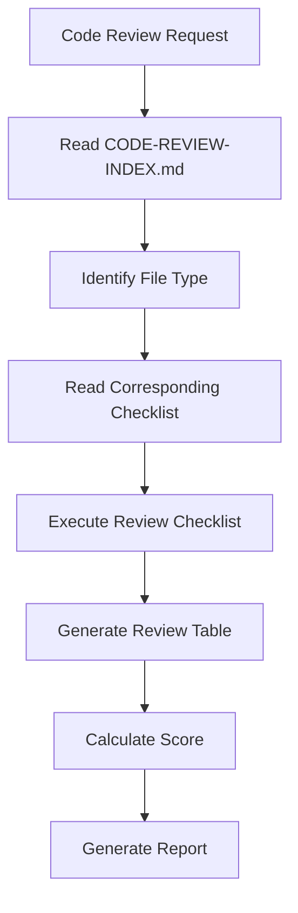

# AI Coding Pattern Language

## Overview

A pattern language for AI-assisted software development that enables AI agents to understand, generate, and validate code patterns consistently. This document provides a formal specification format and catalog of patterns used in AI-assisted development.

---

## Pattern Definition Language

### Pattern Specification Format

All patterns are defined using a JSON-based specification format:

```json
{
  "useCase": "CreateProduct",
  "behavior": "Create a new product",
  "input": [
    { "name": "productId", "type": "String", "note": "唯一識別碼" },
    { "name": "name", "type": "String", "note": "顯示名稱" }
  ],
  "aggregate": "Product",
  "domainEvent": "ProductEvents.ProductCreated",
  "repository": "ProductRepository"
}
```

### Pattern Catalog

| Pattern Category | Patterns Defined | Documentation Location |
|------------------|------------------|------------------------|
| Use Case | Command, Query, Reactor | `.ai/prompts/*-sub-agent-prompt.md` |
| Aggregate | Event Sourcing, State-based | `.ai/tech-stacks/*/coding-standards/aggregate-standards.md` |
| Repository | InMemory, Outbox, EventStore | `.ai/tech-stacks/*/coding-standards/repository-standards.md` |
| Controller | REST API, Adapter | `.ai/prompts/controller-code-generation-prompt.md` |
| Testing | ezSpec, Unit, Integration | `.ai/prompts/test-generation-prompt.md` |

---

## Pattern Anti-Patterns

Common AI coding mistakes are documented as anti-patterns with corrections:

### Anti-Pattern 1: Nested Input/Output Classes

```typescript
// ❌ AI creates: Separate Input.java, Output.java files
// ✅ CORRECT: Inner classes within UseCase interface
interface CreateProductUseCase {
    class CreateProductInput implements Input {
        public productId: string;
        public name: string;
        public userId: string;
    }
    
    class CreateProductOutput implements Output {
        public productId: string;
        public status: string;
    }
}
```

### Anti-Pattern 2: instanceof Chain

```typescript
// ❌ AI writes: Multiple if-else checks with instanceof
if (event instanceof X) {
    // handle X
} else if (event instanceof Y) {
    // handle Y
}

// ✅ CORRECT: Switch expression with pattern matching
switch (event) {
    case ProductEvents.ProductCreated e -> {
        this.id = e.productId();
        this.name = e.name();
    }
    case ProductEvents.ProductRenamed e -> {
        this.name = e.newName();
    }
}
```

### Anti-Pattern 3: Automatic Repository Implementation

```typescript
// ❌ AI generates: Custom repository interface
interface ProductRepository extends Repository<Product, ProductId> {
    List<Product> findBySprintId(SprintId id);  // WRONG: Custom query
}

// ✅ CORRECT: Use framework GenericInMemoryRepository
// No custom Repository interface needed
Repository<Product, ProductId> repository;
```

### Anti-Pattern 4: Contract Validation in Value Objects

```typescript
// ❌ AI uses: Contract.requireNotNull() in Value Object
record ProductId(String value) implements ValueObject {
    public ProductId {
        requireNotNull("value", value);  // WRONG
    }
}

// ✅ CORRECT: Use Objects.requireNonNull()
record ProductId(String value) implements ValueObject {
    public ProductId {
        Objects.requireNonNull(value, "Product ID cannot be null");
    }
}
```

---

## Specification-Driven Development

### Specification Structure

Specifications are organized by aggregate in a structured directory:

```
.dev/specs/
├── [aggregate]/
│   ├── entity/
│   │   └── [aggregate]-spec.md          # Domain model specification
│   └── usecase/
│       ├── [action]-[aggregate].json    # Use case specification
│       └── projection/                  # Query specifications
```

### Specification Schema

```json
{
  "$schema": "./.ai/schemas/use-case-spec-schema.json",
  "useCase": "CreateProduct",
  "behavior": "Create a new product",
  "input": [...],
  "aggregate": "Product",
  "aggregateId": "ProductId",
  "method": "Product constructor",
  "domainEvent": "ProductEvents.ProductCreated",
  "output": "CqrsOutput with productId",
  "domainModelNotes": [
    "Product 是 Aggregate Root",
    "Product 使用建構函數建立新實例"
  ],
  "constructorPreconditions": [...],
  "constructorPostconditions": [...],
  "aggregates": [...],
  "domainEvents": [...],
  "entities": [...],
  "valueObjects": [...],
  "enums": [...]
}
```

### Naming Conventions

| Element | Convention | Example |
|---------|------------|---------|
| Use Case | `[action]-[aggregate].json` | `create-product.json` |
| Entity Spec | `[aggregate]-spec.md` | `product-spec.md` |
| Controller Spec | `[action]-[aggregate]-controller.json` | `get-product-controller.json` |
| Projection | `[dto-name]-projection.json` | `product-dto-projection.json` |

---

## Sub-Agent System Architecture

### Agent Specialization Model

| Agent Type | Responsibility | Prompt File |
|------------|----------------|-------------|
| Command | Generate Command Use Cases | `command-sub-agent-prompt.md` |
| Query | Generate Query Use Cases | `query-sub-agent-prompt.md` |
| Aggregate | Generate DDD Aggregates | `aggregate-sub-agent-prompt.md` |
| Reactor | Generate Event Handlers | `reactor-sub-agent-prompt.md` |
| Controller | Generate REST Controllers | `controller-code-generation-prompt.md` |
| Outbox | Generate Outbox Pattern | `outbox-sub-agent-prompt.md` |
| Test | Generate Tests | `test-generation-prompt.md` |
| Code Review | Review Generated Code | `code-review-prompt.md` |

### Context Management

Sub-agents receive complete context including:

```python
context = {
    "spec": read_file(spec_path),
    "coding_standards": read_file(".ai/tech-stacks/*/coding-standards/*.md"),
    "examples": read_file(".ai/tech-stacks/*/examples/*.java"),
    "common_rules": read_file(".ai/prompts/shared/common-rules.md"),
    "framework_api": read_file(".ai/guides/FRAMEWORK-API-INTEGRATION-GUIDE.md"),
    "project_config": read_file(".dev/project-config.json")
}
```

---

## Code Review Framework

### Mandatory Code Review Process



### Review Checklist Structure

| Level | Focus Area | Checklist Items |
|-------|------------|-----------------|
| 1 | Architecture | Package location, Layer compliance, Clean Architecture |
| 2 | Coding Standards | Input/Output patterns, Annotations, Repository usage |
| 3 | Business Logic | Contract validation, Error handling, Domain rules |

### Review Output Format

```markdown
## Code Review Report

| Check Item | Result | Location | Issue Description |
|------------|--------|----------|-------------------|
| Package Location | ✅ | - | Correct |
| Input as Inner Class | ❌ | Line 45 | Input should be UseCase inner class |
| Repository Pattern | ✅ | - | Correct |

### Summary
- **Critical Issues**: 0
- **Must Fix Issues**: 1
- **Should Fix Issues**: 2
- **Score**: 4/5 ⭐⭐⭐⭐
```

---

## Testing Strategy

### Testing Pyramid

```
        ┌─────────────┐
        │   E2E Tests │    ← Minimum (Critical user flows only)
        ├─────────────┤
       │ Integration  │   ← Moderate (API, Database, Events)
       │    Tests     │
       ├─────────────┐
      │   Unit Tests  │   ← Maximum (Domain logic, Use cases)
      │  (ezSpec BDD) │
      └─────────────┘
```

### Test Generation Patterns

```typescript
// ✅ GOOD - BDD-style test structure
@EzFeature
class CreateProductUseCaseTest {
    static Feature feature = Feature.New("Create Product Use Case");
    
    @EzScenario
    public void should_create_product_with_valid_input() {
        feature.newScenario("Successfully create a product with valid input")
            .Given("valid product creation input", env -> {
                var input = CreateProductInput.create();
                input.productId = "prod-001";
                input.name = "Test Product";
                input.userId = "user-001";
                env.put("input", input);
            })
            .When("the use case is executed", env -> {
                var input = env.get("input", CreateProductInput.class);
                var output = useCase.execute(input);
                env.put("output", output);
            })
            .Then("the product should be created successfully", env -> {
                var output = env.get("output", CqrsOutput.class);
                assertThat(output.isSuccessful()).isTrue();
            })
            .Execute();
    }
}
```

---

## AI Coding Patterns Reference

### Pattern Categories

| Category | Patterns | Description |
|----------|----------|-------------|
| **Use Case** | Command, Query, Reactor | Business operation patterns |
| **Aggregate** | Event Sourcing, State-based | Domain entity patterns |
| **Repository** | InMemory, Outbox, EventStore | Data access patterns |
| **Adapter** | REST API, Message Handler | Integration patterns |
| **Testing** | ezSpec, Unit, Integration | Test structure patterns |

### Pattern Selection Guide

```
┌─────────────────────────────────────────────────────────────────────────┐
│                    PATTERN SELECTION DECISION TREE                       │
├─────────────────────────────────────────────────────────────────────────┤
│                                                                         │
│  What type of operation?                                                │
│         │                                                               │
│         ├─── Write Operation ───► Command Use Case                      │
│         │                                                               │
│         ├─── Read Operation ───► Query Use Case                         │
│         │                                                               │
│         └─── Event Handling ───► Reactor Pattern                        │
│                                                                         │
│  What domain pattern?                                                   │
│         │                                                               │
│         ├─── Persistent Aggregate ───► Event Sourcing                   │
│         │                                                               │
│         ├─── Simple Entity ───► State-based Aggregate                   │
│         │                                                               │
│         └─── Transient Data ───► Value Object                           │
│                                                                         │
│  What data access pattern?                                              │
│         │                                                               │
│         ├─── In-memory Storage ───► GenericInMemoryRepository           │
│         │                                                               │
│         ├─── Outbox Pattern ───► Outbox Repository                      │
│         │                                                               │
│         └─── Event Sourcing ───► EventStore Repository                  │
│                                                                         │
└─────────────────────────────────────────────────────────────────────────┘
```

---

## Common AI Mistakes and Corrections

### File Structure Mistakes

| Mistake | Correction | Severity |
|---------|------------|----------|
| Separate Input.java file | Use inner class | Critical |
| Separate Output.java file | Use inner class | Critical |
| Package mismatch | Match layer structure | High |
| Wrong annotation | Use framework conventions | Medium |

### Repository Mistakes

| Mistake | Correction | Severity |
|---------|------------|----------|
| Custom repository methods | Use framework methods only | High |
| Repository interface in impl | Interface in domain, impl in infra | Critical |
| No generic type parameters | Use Repository<T, ID> | Medium |

### Domain Pattern Mistakes

| Mistake | Correction | Severity |
|---------|------------|----------|
| Mutable value objects | Make immutable | High |
| instanceof chains | Use pattern matching | Medium |
| Primitive obsession | Use value objects | Medium |
| Missing aggregate invariants | Enforce in aggregate root | Critical |

---

## References

1. doc/agents-md-cli-ai-agent-tools.md - CLI AI Agent Tools
2. doc/prompt-engineering-ai-agents.md - Prompt Engineering Guide
3. doc/on-demand-rule-loading.md - On-Demand Rule Loading
4. ref/ai-coding-exercise-analysis.md - AI Coding Exercise Analysis
5. ref/engineering/context_engineering/CAAP.md - Context Engineering
6. ref/engineering/METHODOLOGIES.md - Development Methodologies
        ┌─────────────┐
        │   E2E Tests │    ← Minimum (Critical user flows only)
        ├─────────────┤
       │ Integration  │   ← Moderate (API, Database, Events)
       │    Tests     │
       ├─────────────┤
      │   Unit Tests  │   ← Maximum (Domain logic, Use cases)
      │  (ezSpec BDD) │
      └─────────────┘
```

### ezSpec BDD Framework

```java
@EzFeature
public class CreateProductUseCaseTest {
    static Feature feature = Feature.New("Create Product Use Case");
    
    @EzScenario
    public void should_create_product_with_valid_input() {
        feature.newScenario("Successfully create a product with valid input")
            .Given("valid product creation input", env -> {
                var input = CreateProductInput.create();
                input.productId = "prod-001";
                input.name = "Test Product";
                input.userId = "user-001";
                env.put("input", input);
            })
            .When("the use case is executed", env -> {
                var input = env.get("input", CreateProductInput.class);
                var output = useCase.execute(input);
                env.put("output", output);
            })
            .Then("the product should be created successfully", env -> {
                var output = env.get("output", CqrsOutput.class);
                assertThat(output.isSuccessful()).isTrue();
                assertThat(publishedEvents).hasSize(1);
                assertThat(publishedEvents.get(0))
                    .isInstanceOf(ProductEvents.ProductCreated.class);
            })
            .Execute();
    }
}
```

---

## Architecture Decision Records (ADRs)

### ADR Format

```markdown
# ADR-005: AI Task Execution SOP

## Status
Accepted

## Context
AI agents need a standardized workflow for task execution

## Decision
Implement 5-step SOP:
1. Create TodoWrite tracking
2. Execute pipeline.steps
3. Execute postChecks
4. Update results
5. Update status

## Consequences
- ✅ Consistent task execution
- ✅ Traceable AI behavior
- ✅ Automated reporting
```

### Common ADRs

| ADR ID | Title | Impact |
|--------|-------|--------|
| ADR-001 | Use Case Package Structure | High |
| ADR-005 | AI Task Execution SOP | High |
| ADR-010 | No @Component for Services | High |
| ADR-019 | OutboxMapper as Inner Class | High |
| ADR-021 | Profile-Based Testing | High |
| ADR-031 | Reactor Interface | High |
| ADR-043 | Audit Fields in Metadata | Medium |

---

## Failure Case Analysis

### Documented Failure Cases

#### Case 1: Value Object Validation Error

```typescript
// ❌ AI Code:
record ProductId(String value) implements ValueObject {
    public ProductId {
        requireNotNull("value", value);  // WRONG: Uses Contract
    }
}

// ✅ CORRECT:
record ProductId(String value) implements ValueObject {
    public ProductId {
        Objects.requireNonNull(value, "value cannot be null");
    }
}
```

#### Case 2: Repository Pattern Violation

```typescript
// ❌ AI Code:
interface ProductRepository extends Repository<Product, ProductId> {
    List<Product> findBySprintId(SprintId id);  // WRONG: Custom query
}

// ✅ CORRECT:
// Use framework GenericInMemoryRepository
// Complex queries via Projection
```

#### Case 3: Input Class Location

```typescript
// ❌ AI Code:
// Separate Input.java file
public class CreateProductInput implements Input { ... }

// ✅ CORRECT:
// Inner class in UseCase interface
public interface CreateProductUseCase {
    class CreateProductInput implements Input { ... }
}
```

### Learning Integration

All failure cases are:
1. Documented in `.dev/lessons/FAILURE-CASES.md`
2. Integrated into Sub-agent prompts
3. Added to Code Review checklists
4. Used for automated detection

---

## References

- AI Coding Exercise Repository: https://gitlab.com/TeddyChen/ai-coding-exercise.git
- Related documentation: Clean Architecture, DDD, Test-Driven Development
